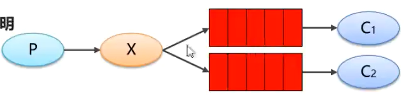
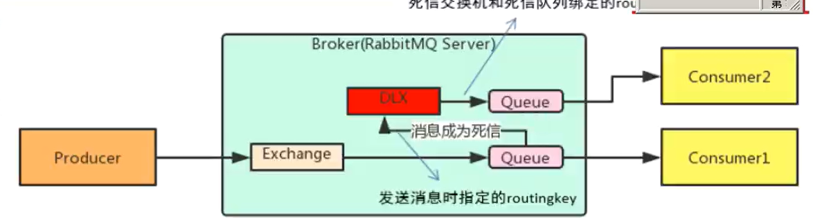
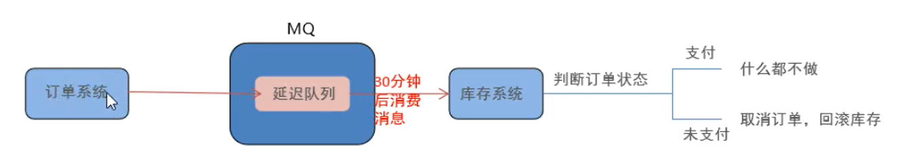
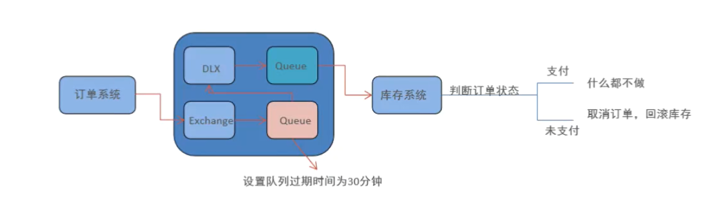
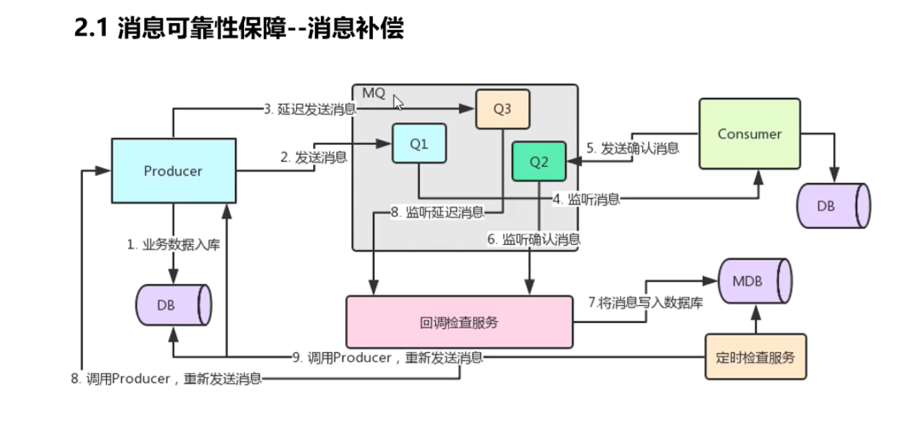
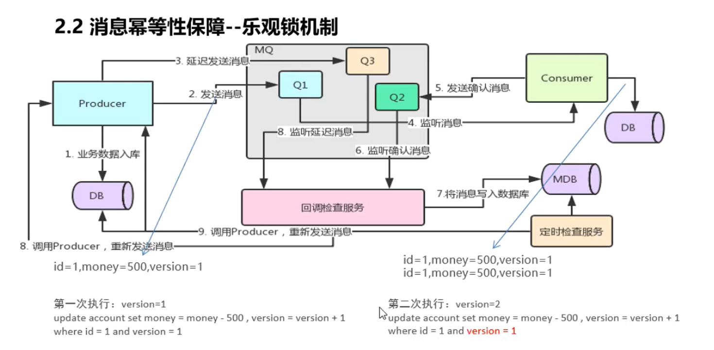
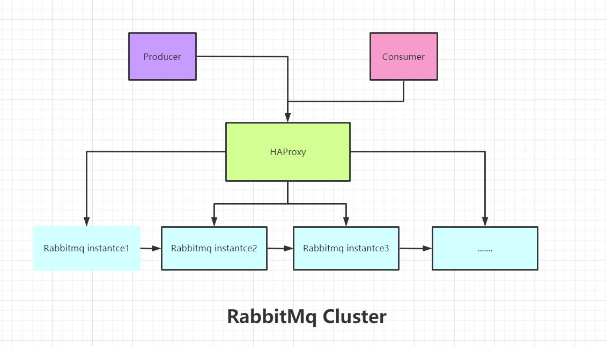
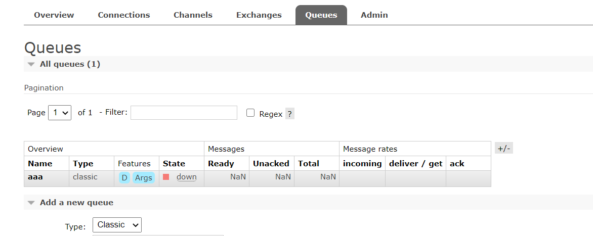

## RabbitMq 学习总结

### 1.MQ

#### 1.1 不同mq的特点

```reStructuredText
# 1. ActiveMq
     ActiveMq是Apache出品，最流行的，能力最强劲的小心总线。它是一个完全支持JMS规范的消息中间件。丰富的API,多种集群架构模式让ActiveMQ在业界成为老牌的消息中间件，在中小型企业颇为欢迎。
     
# 2. Kafka
     Kafka是linked-in开源的分布式发布订阅消息系统，目前归属Apache顶级项目。Kafka主要特点是基于pull的模式来处理消息消费，追求高吞吐量，一开始的目的就是用于日志的收集和传输。0.8版本后开始支持复制，不支持事务，对消息的重复，丢失，错误没有严格要求。适合产生大数据量的互联网服务的数据收集业务。
     
# 3. RocketMQ
     RocketMq是阿里开源的小心中间件，它是纯java开发，具有高吞吐量，高可用性，适合大规模分布式系统应用的特点，RocketMQ思路起源于Kafka，但并不是kafka的一个copy，他对消息的可靠性传输及事务性做了处理和优化，目前在阿里集团被广泛应用于交易、充值、流计算、消息推送、日志流式处理、binglog分发等场景
     
# 4. RabbitMQ
     Rabbitmq 是使用Elang语言开发的，基于AMQP协议来实现，AMQP协议主要特征面向消息、队列、路由（包含点对点和发布/订阅）、可靠性、安全性。AMQP协议更多用在企业系统内对数据一致性、稳定性和可靠性要求很高的场景，对性能和吞吐量换在其次。
     

```

```java
/***
Rabbitmq 比kafka更可靠，kafka更适合吞吐量比较大的业务，一般应用于大数据日志处理或者对实时性（少量延迟），可靠性（少了丢失数据）要求低的场景使用
***/
```

### 2. RabbitMq的安装

 ```java
基于AMQP协议，elang语言开发的（专门做socket开发），是部署最广泛的开源消息中间价，是最受欢迎的消息中间之一。（几乎不丢失消息）
 ```

基于`Ubuntu 20.0.4 version`  `rabbitmq-server 3.8.9` `Erlang 23.1.1`

```bash
curl -fsSL https://github.com/rabbitmq/signing-keys/releases/download/2.0/rabbitmq-release-signing-key.asc | sudo apt-key add -
```

```bash
sudo apt-key adv --keyserver "hkps://keys.openpgp.org" --recv-keys "0x0A9AF2115F4687BD29803A206B73A36E6026DFCA"
```

为了使用apt能够安装rabbitmq server和Erlang包，开启apt https tranport

```bash
sudo apt-get install apt-transport-https
```

添加源文件列表` /etc/apt/sources.list.d/bintray.erlang.list`

```bash
## Installs the latest 22.x version available in the repository.
## Please see the distribution name table above.

deb https://dl.bintray.com/rabbitmq-erlang/debian bionic erlang-22.x
```

更新apt 源

```bash
sudo apt-get update -y
```

```bash
# This is recommended. Metapackages such as erlang and erlang-nox must only be used
# with apt version pinning. They do not pin their dependency versions.
sudo apt-get install -y erlang-base \
                        erlang-asn1 erlang-crypto erlang-eldap erlang-ftp erlang-inets \
                        erlang-mnesia erlang-os-mon erlang-parsetools erlang-public-key \
                        erlang-runtime-tools erlang-snmp erlang-ssl \
                        erlang-syntax-tools erlang-tftp erlang-tools erlang-xmerl
```


start downloading

```bash
#!/bin/sh

## If sudo is not available on the system,
## uncomment the line below to install it
# apt-get install -y sudo

sudo apt-get update -y

## Install prerequisites
sudo apt-get install curl gnupg -y

## Install RabbitMQ signing key
curl -fsSL https://github.com/rabbitmq/signing-keys/releases/download/2.0/rabbitmq-release-signing-key.asc | sudo apt-key add -

## Install apt HTTPS transport
sudo apt-get install apt-transport-https

## Add Bintray repositories that provision latest RabbitMQ and Erlang 23.x releases
sudo tee /etc/apt/sources.list.d/bintray.rabbitmq.list <<EOF
## Installs the latest Erlang 23.x release.
## Change component to "erlang-22.x" to install the latest 22.x version.
## "bionic" as distribution name should work for any later Ubuntu or Debian release.
## See the release to distribution mapping table in RabbitMQ doc guides to learn more.
deb https://dl.bintray.com/rabbitmq-erlang/debian bionic erlang
## Installs latest RabbitMQ release
deb https://dl.bintray.com/rabbitmq/debian bionic main
EOF

## Update package indices
sudo apt-get update -y

## Install rabbitmq-server and its dependencies
sudo apt-get install rabbitmq-server -y --fix-missing
```

### 3. RabbitMQ 快速操作

```xml
<dependency>
    <groupId>com.rabbitmq</groupId>
    <artifactId>amqp-client</artifactId>
    <version>5.6.0</version>
</dependency>
```


  ```java
/**
java client 生产者
**/
package com.itan;


import com.rabbitmq.client.Channel;
import com.rabbitmq.client.Connection;
import com.rabbitmq.client.ConnectionFactory;

import java.io.IOException;
import java.util.concurrent.TimeoutException;

/**
 * java 客户端方式 （生产者）
 */
public class RabbitmqProducer {
    public static void main(String[] args) throws IOException, TimeoutException {
        //1.建立连接工厂
        ConnectionFactory connectionFactory = new ConnectionFactory();

        //2.设置参数
        connectionFactory.setHost("192.168.179.129");
        connectionFactory.setPassword("root");
        connectionFactory.setUsername("root");
        connectionFactory.setPort(5672);
        connectionFactory.setVirtualHost("/mq-vs");
        //3.创建连接Connection
        Connection connection = connectionFactory.newConnection();
        //4.创建Channel
        Channel channel = connection.createChannel();
        //5.创建队列Queue
        /**
         * queueDeclare(String queue, boolean durable, boolean exclusive, boolean autoDelete, Map<String, Object> arguments)
         * 1. queue 队列名称
         * 2. durable 是否持久化，当mq重启之后消息还在
         * 3. exclusive 一，是否独占（只能有一个消费者监听队列）二. 当connection关闭时 是否删除队列
         * 4.autoDelete 没有consumer时，自动删除掉
         * 5. arguments 参数
         */
        //如果没有一个叫hello_queue 的队列，则会自动创建
        channel.queueDeclare("hello_queue",true,false,false,null);
        //6.发送消息
        /**
         * basicPublish(String exchange, String routingKey, BasicProperties props, byte[] body)
         * 1. exchange 交换机名称，简单模式下 交换机是默认的""
         * 2. routingkey 路由名称  交换机为默认的"" ,则routingkey 必须是和queue 一样
         * 3. props 配置信息
         * 4. body 消息
         */
        channel.basicPublish("","hello_queue",null,"我是消息".getBytes());

        //释放资源
        channel.close();
        connection.close();
    }
}

    
    
  ```

消费端：

```java
package com.itan;

import com.rabbitmq.client.*;

import java.io.IOException;
import java.util.concurrent.TimeoutException;

public class RabbitmqConsumer {
    public static void main(String[] args) throws IOException, TimeoutException {
        //1.创建连接工厂
        ConnectionFactory connectionFactory = new ConnectionFactory();
        //2.设置参数
        connectionFactory.setVirtualHost("/mq-vs");
        connectionFactory.setHost("192.168.179.129");
        connectionFactory.setUsername("root");
        connectionFactory.setPort(5672);
        connectionFactory.setPassword("root");
        //3. 创建连接
        Connection connection = connectionFactory.newConnection();
        //4. 创建channel
        Channel channel = connection.createChannel();
        //5. 消费消息
        Consumer consumer = new DefaultConsumer(channel){
            /**
             * 回调方法（当收到消息，会自动执行该方法）
             * @param consumerTag  消息唯一标识
             * @param envelope 获取一些交换机的信息，routingkey的信息等等
             * @param properties 配置信息
             * @param body  消息体
             * @throws IOException
             */
            @Override
            public void handleDelivery(String consumerTag, Envelope envelope, AMQP.BasicProperties properties, byte[] body) throws IOException {
                System.out.println("consumertag: "+consumerTag);
                System.out.println("envelope: "+envelope.toString());
                System.out.println("properties: "+properties.toString());
                System.out.println("body: "+new String(body));
            }
        };
        /**
         * (String queue, boolean autoAck, Consumer callback)
         * 1. queue 队列名称
         * 2. autoAck 是否自动确认 如果false 则消息为unacked，容易造成消息堆积。
         * 3. callback 回调函数
         */
        channel.basicConsume("hello_queue",true,consumer);

//        channel.close();
//        connection.close();

    }
}
```

### 4. RabbitMq 的工作模式

#### 4.1 workqueue工作队列模式

```java
//工作队列
1. 一个队列中如果绑定了多个消费者，那么消费者之间是竞争关系（轮询方式）
```

`java 代码如下`

```java
package com.itan;

import com.rabbitmq.client.Channel;
import com.rabbitmq.client.Connection;
import com.rabbitmq.client.ConnectionFactory;

import java.io.IOException;
import java.util.concurrent.TimeoutException;

/**
 * 工作队列模式 workqueue
 */
public class WorkQueueProducer {
    public static void main(String[] args) throws IOException, TimeoutException {
        //1.建立连接工厂
        ConnectionFactory connectionFactory = new ConnectionFactory();

        //2.设置参数
        connectionFactory.setHost("192.168.179.129");
        connectionFactory.setPassword("root");
        connectionFactory.setUsername("root");
        connectionFactory.setPort(5672);
        connectionFactory.setVirtualHost("/mq-vs");
        //3.创建连接Connection
        Connection connection = connectionFactory.newConnection();
        //4.创建Channel
        Channel channel = connection.createChannel();
        //5.创建队列Queue
        /**
         * queueDeclare(String queue, boolean durable, boolean exclusive, boolean autoDelete, Map<String, Object> arguments)
         * 1. queue 队列名称
         * 2. durable 是否持久化，当mq重启之后消息还在
         * 3. exclusive 一，是否独占（只能有一个消费者监听队列）二. 当connection关闭时 是否删除队列
         * 4.autoDelete 没有consumer时，自动删除掉
         * 5. arguments 参数
         */
        //如果没有一个叫hello_queue 的队列，则会自动创建
        channel.queueDeclare("work_queue",true,false,false,null);
        //6.发送消息
        /**
         * basicPublish(String exchange, String routingKey, BasicProperties props, byte[] body)
         * 1. exchange 交换机名称，简单模式下 交换机是默认的""
         * 2. routingkey 路由名称  交换机为默认的"" ,则routingkey 必须是和queue 一样
         * 3. props 配置信息
         * 4. body 消息
         */
        //一次生产10条消息
        for(int i=1;i<=10;i++){
            String body = i+"rabbit mq message .....";
            channel.basicPublish("","work_queue",null,body.getBytes());
        }

        //释放资源
        channel.close();
        connection.close();
    }
}

```

`workqueue_consumer1 代码`

```java

```

####  4.2 Pub/Sub 发布订阅模式



> 模式说明：在订阅模型中多一个Exchange 角色，而过程略有变化

+ P: 生产者，也就是消息发送者，但是不再 发送到队列中，而是发给X（交换机）
+ C:消费者，消息的接收者，会一直等待消息的到来。
+ Queue：消息队列，接收消息，缓存消息
+ Exchange：交换机（X），一方面，接收生产者发送的消息，另一方面，知道如何处理消息，例如提交给某个特别队列、递交给所有队列、或是将消息丢弃。到底如何操作，取决Exchange类型。Exchange有常见一下3种类型：
  - Fanout: 广播，将消息交给所有绑定到交换机的队列
  - Direct：定向，把消息交给符合routingkey的队列
  - Topic：通配符，把消息交给符合routing pattern（路由模式）的队列

<font color='red'>Exchange</font> 只负责转发消息，不具备存储消息的能力，因此如果没有任何队列与Exchange绑定，或者没有符合路由规则的队列，那么消息会丢失。

> 注意：若指定交换机类型为fanout ，则不用指定routingkey，因为fanout是将消息广播给与他绑定的所有queue

##### 4.2.1 Fanout 模式

   没有routingkey ，默认是"",会把消息发送给所有与fanout交换机绑定的队列

##### 4.2.2 Direct 模式

  全量匹配 routingkey

##### 4.2.3 Topic 模式

通配符 *和#代替，*  * 代表一个单词，#代表一个或者多个

### 5. 消息的可靠投递

  ##### 5.1 生产端

作为消息发送方希望任何时候杜绝消息的丢失和投递失败场景，Rabbitmq为我们提供了两种方式用来控制消息的投递可靠性模式。

+ **confirm模式**
+ **return模式**

Rabbitmq 整个消息投递的路径为：

**producer->rabbitmq broker->exchange->queue->consumer**

> confirm 模式：message 从producer到exchange，则会返回一个comfirmCallback，无论投递成功与否，都会执行
>
> 开启confirm 模式  **publisher-comfirm=true**

> return 模式：消息从exchange 到queue **投递失败**则会返回一个returnCallback（**注意只有失败才会**）
>
> return模式 步骤：
>
> 1. 开启回退模式  **publisher-returns=true**
> 2. 设置ReturnCallBack 并且必须设置**channel.setMandatory(true)**，要不然不起作用
> 3. 设置Exchange处理消息的模式(有2种)：
>    - 如果消息没有路由到Queue，则丢弃消息（默认）
>    - 如果消息没有路由到Queue，则返回给消息发送方ReturnCallBack


##### 5.2 消费端

**consumer Ack**  Ack 是指Acknowledge，确认。表示消费端收到消息后的确认方式。

有三种确认方式：

 + 自动确认：Acknowledge=none

 + 手动确认：Ackknowledge=manual

 + 根据异常情况确认：acknowledge=auto（这种方式使用麻烦，不做讲解）
   一般要根据异常的类型来做处理（**重发还是处理丢弃**）

   其中自动确认是指，当消息一旦到达消费端，则消息进行自动确认，rabbitmq server将会从queue将消息删除，不管你是消息处理成功与否。但是实际业务情况中，很可能消息接收到，业务处理异常，那么该消息就会丢失。如果设置了手动确认方式，则需要在业务处理成功后，手动调用channel.baiscAck(),手动签收，如果出现异常，则调用channel.basicNack()，让其自动重发消息。

   

   ```java
       @RabbitListener(queues="ack_topic_queue")
       public void getMessage(Message message, Channel channel) throws Exception {
   
           try {
               System.out.println("message ack is received: "+message.toString());
               int i = 4/0;
               channel.basicAck(message.getMessageProperties().getDeliveryTag(),false);
           } catch (Exception e) {
               System.out.println("throw a exception, retry.......");
               channel.basicNack(message.getMessageProperties().getDeliveryTag(),false,true);//第三个参数是requeue 是否返回队列，
           }
           System.out.println("dfd.................");
   //        channel.basicAck(message.getMessageProperties().getDeliveryTag(),false);
   
       }
   
   ```


##### 5.3 deliveryTag 消息标识码

```java
//当消费者向Rabbitmq 注册之后，Rabbitmq将通过basic.deliver方法投递消息给消费者，在每一次投递的消息体上，都会携带一个deliveryTag，这个值在每个通道上是唯一的，用来标识本次投递。
//deliverTag是单调递增的正整数，64位长度，值从1开始，每次发送消息值递增1，最大值为9223372036854775807
//消费者在收到消息后，向rabbitmq发送应答消息时，带上这个deliverTag，告诉rabbitmq 某次消息投递已经成功接收。
```

##### 5.4 批量确认

手动确认方式也支持批量确认，这样可以显著减少网络流量。

```java
//手动确认是通过将multiple设置为true来实现，这样会对deliverTag以及比deliverTag 值小的消息一同批量确认
```

批量否定

```java
 channel.basicNack(message.getMessageProperties().getDeliveryTag(),false,true);//第三个参数是requeue 是否返回队列，如果为ture 则返回消息队列，重新发送给消费者，如果为false 则消息丢弃
```

channel.basicReject 只能否定单个消息，channel.basicNack可以批量否定

```java
basicReject(long deliveryTag, boolean requeue)
basicNack(long deliveryTag, boolean multiple, boolean requeue) 
```

### 6. TLL延迟消息 /队列

TTL  队列设置x-message-ttl有两种过期模式

+ 队列统一过期---》意思是队列中的所有消息到指定时间时，消息全部自动删除了。**通过设置x-message-ttl, 每个消息都会被标记为过期时间为x-message-ttl设置的时间，在经过指定的时间后，会从队列中自动删除**

+ 消息单独过期--

  ```java
      
  //消息后处理对象
  @Test
      public void testTtl(){
  
          MessagePostProcessor processor = new MessagePostProcessor() {
              @Override
              public Message postProcessMessage(Message message) throws AmqpException {
                  message.getMessageProperties().setExpiration("5000");//设置单个消息的过期时间
                  return message;
              }
          };
          for(int i=1;i<=4;i++){
              rabbitTemplate.convertAndSend(RabbitmqConfig.ACK_EXCHANGE_NAME,"ack.send.test","test messaage",processor);
  
          }
      }
  ```

  > 注意的是：队列的消息先过期时间短的消息

+ 队列过期---》通过设置auto-exprie，自动删除队列


   **单个消息的过期的设置，如果这个消息没有在队列的顶端或者说它不是马上要被消费了， rabbitmq 不会启动过期时间，只有当这个消息在队列顶端了，设置的过期时间才会起作用。**

### 7. 死信队列

死信队列，英文缩写:DLX  ,dead letter exchange（死信交换机），当消息成为dead message之后，可以被重新发送到另一个交换机，这个交换机叫DLX.

#### 7.1 死信队列的三种情况

+ 消息的长度超过队列的长度 ，队列长度10，第11个消息来的时候，就成为死信消息
+ 消费者拒绝签收消息，**channel.basicNack/channel.basicReject** ,但是消息没有返回到原来的队列中，设置了**requeue=false**,那么这样的消息就成为死信消息
+ **队列设置过期时间x-message-ttl**,消息在过期时间内没有被消费就成为死信消息。

#### 7.2 队列绑定死信交换机

​     给队列设置参数：x-dead-letter-exchange和x-dead-letter-routing-key 可以将dead message 路由到死信队列中区




#### 7.4 延迟队列实现（需要重点掌握）

   ##### 7.4.1 什么是延迟队列

      ```markdown
延迟队列：即消息进入队列后不会立即被消费，只有达到**指定时间**后，才会被消费。

      ```

##### 7.4.2 场景

+ 订单超过半个小时后，未支付，取消订单，并且回滚库存
+ 新用户注册后成功7天后，发送短信问候

```java
//实现方式
1. 定时器
    缺点：定时器该设置多少秒区轮询呢，长的话时间会延迟，短的化影响性能。
2. TTL+DLX(推荐使用)
   
```

TTL+DLX 实现方式：



​    但是在Rabbitmq中没有延迟队列，不过我们可以使用<font color='red'>**TTL+DLX**</font>来实现这样的效果



```java

```

### 8. 消息追踪

 ```java
/**在使用任何消息中间件的过程中，难免会出现某条消息异常丢失的情况，对于Rabbitmq而言，可能是因为生产者或者消费者与Rabbitmq断开了连接，而它们与Rabbitmq又采用了不同的确认机制，也有可能是因为交换机与队列之间不同的转发策略，甚至是交换机并没有与任何队列进行绑定，生产者又感知不到或者没有采取相应的措施；另外Rabbitmq本身的集群策略也可能导致消息的丢失。这个时候就需要有一个较好的机制跟踪记录消息的投递过程，以此协助开发人员和运维人员进行问题定位。

在Rabbitmq中可以使用Firehouse和rabbitmq_tracing插件功能来实现消息跟踪。

 ```

```markdown
注意打开trace 会影响消息写入的功能，适当打开后请关闭
rabbitmqctl trace_on: 开启firehouse 命令
rabbtimqctl trace_off: 关闭firehouse 命令

也可以使用rabbitmq 插件功能 rabbitmq-plugins enable rabbitmq-tracing
可以在监控平台admin 页面使用。
```

### 9.Rabbitmq 消息应用问题

#### 9.1 rabbitmq 消息可靠性保证

+ 消息补偿机制
  

#### 9.2消息幂等性保障

+ 乐观锁解决方案

+ 使用redis 的setnx

  > setnx(key,value) 说明key不存在则插入成功且返回1，如果key存在，则不进行任何操作，返回0；


+ 


### 10.Rabbitmq 集群搭建

 ```markdown
Rabbimq天然支持Clustering，这使得Rabbitmq本身不需要像ActiveMq、Kafka那样通过zookeeper分别来实现HA方案和保存集群的元数据，集群是保证可靠性的一种方式，同时可以通过水平扩展以达到增加消息吞吐量能力的目的

 ```



#### 10.1 Rabbitmq 单机多实例集群（镜像队列）

  ```java
1. rabbtimqctl status //查看rabbitmq的服务状态
2. 第一步 停止rabbitmq 服务
    service rabbitmq-server stop
3. 启动第一个节点
    RABBITMQ_NODE_PORT=5673 RABBITMQ_NODENAME=rabbit1 rabbitmq-server start
    
    启动第二个节点 

  ```




 ```markdown
注意一定要配置policy 同步消息到每个节点。
 ```

#### 10.2.负载均衡-HAProxy 安装搭建

   配值haproxy.cg  ,配置统一出口


### 11.Rabbitmq 常见应用问题

#### 11.1 消息堆积

​    当消息的生产速度大于消费速度，就会造成消息堆积

1. 消息堆积影响
   + 可能导致新消息无法进入队列
   + 可能导致就消息无法丢失
   + 消息等待的消费的时间过长，超出业务容忍范围
2. 产生堆积的情况
   + 生产者大量消息
   + 消费者消费失败
   + 消费者出现性能瓶颈
   + 消费者挂了
3. 解决办法
   + 排查消费者消费性能
   + 增加消费者
   + 多线程消费
4. 场景介绍

#### 11.2 有序消费

      1. 单个队列对应一个消费者
         2. 内存队列 BlockingQueue

#### 11.3 重复消费

1. 通过cas 数据 版本号
2. 通过redis存储id  ，通过setnx 来做操作判断


